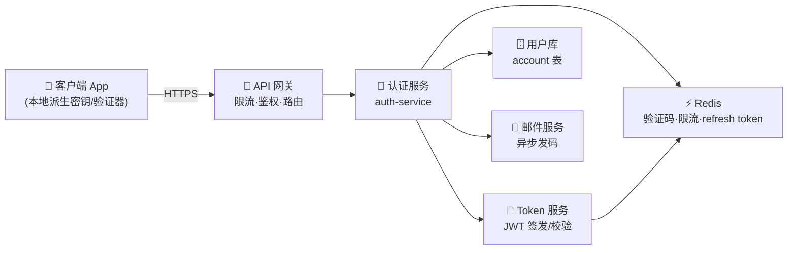
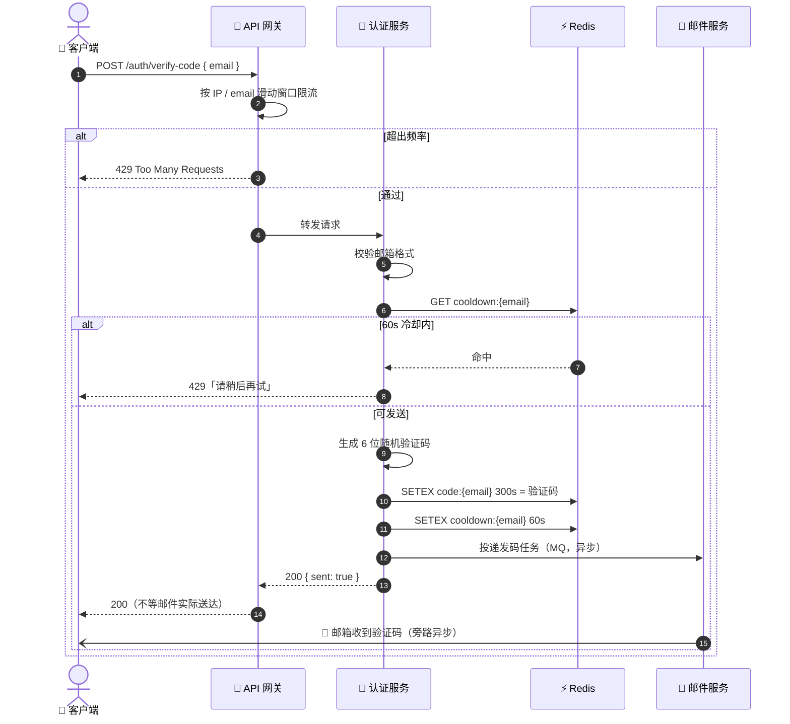
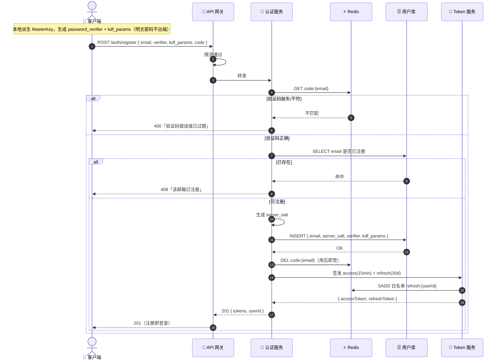
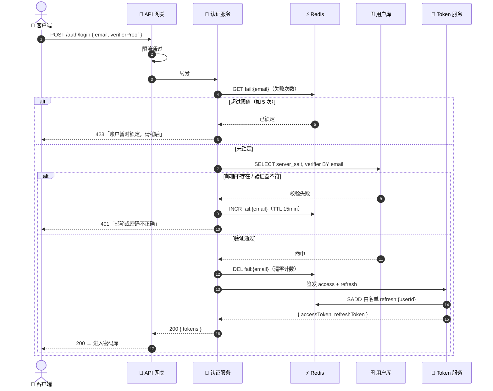
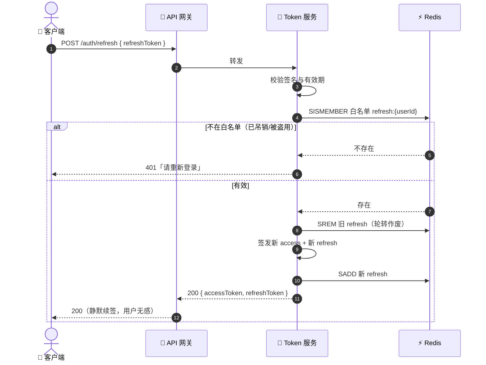
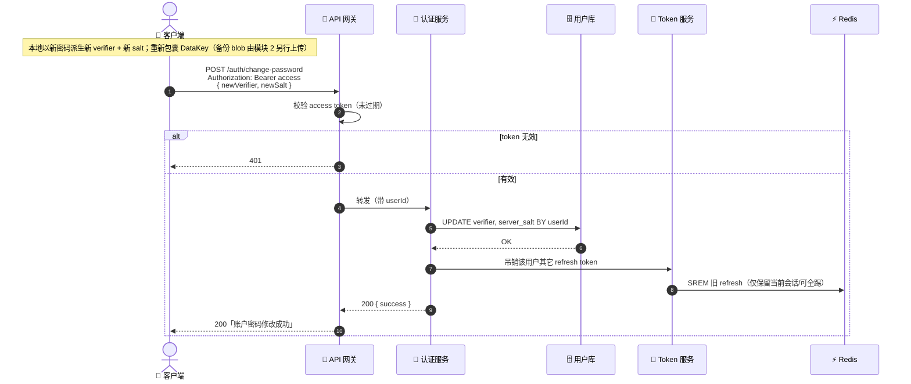
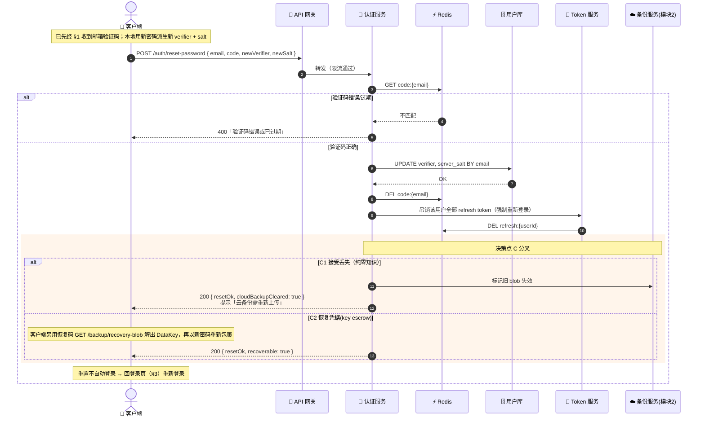
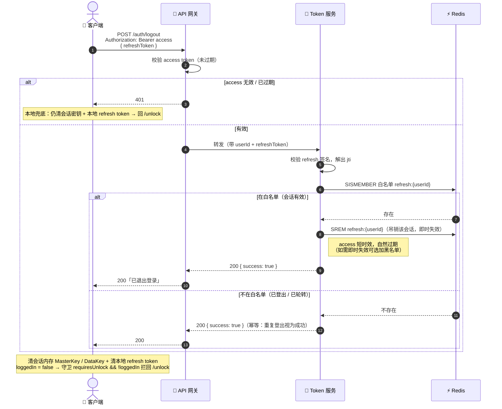

# SafeVault 模块 1：云账户与认证 — 后端交互时序图

> 配套文档：`SafeVault模块和接口设计 v1.0.md` 第二节「模块 1：云账户与认证」。
> 本文从**客户端发起请求**出发，描绘请求在后端各关键组件间的流转，到结果返回的完整链路。
> 约束：**零知识**——客户端本地用云账户密码派生密钥，发往后端的只是「密码验证器」与密文，后端**永不接触明文密码 / 明文数据**。
> 更新日期：2026-06-09

---

## 一、后端组件总览

模块 1 涉及的后端关键组件及其职责：

| 组件 | 职责 | 关键存储 |
| --- | --- | --- |
| API 网关 | TLS 终结、按 IP/邮箱限流、转发、access token 预校验 | — |
| 认证服务 | 注册/登录/改密/重置业务编排，密码验证器比对 | — |
| Token 服务 | 签发 access（短时效）/ refresh（可留存）token、轮转、吊销 | Redis |
| Redis | 验证码（TTL 300s）、发码冷却、登录失败计数、refresh token 白名单 | — |
| 用户库 | 账户记录：`email`、`server_salt`、`password_verifier`、`kdf_params` | 持久化 |
| 邮件服务 | 通过 MQ 异步投递验证码邮件，不阻塞主链路 | — |

> **零知识要点**：`account` 表只存 `password_verifier`（如 SRP verifier 或「密码+服务端盐」的慢哈希），**不存明文、不存可还原密钥**。后端能验证身份，但拿不到 MasterKey。

---

## 1. 下发邮箱验证码 `POST /auth/verify-code`

注册 / 重置共用。重点：网关限流 + Redis 发码冷却 + 邮件异步投递（主链路不等 SMTP）。

---

## 2. 注册开户 `POST /auth/register`

客户端**本地**已用密码派生出 `password_verifier` 与 KDF 参数，请求体携带的是验证器（非明文）。校验验证码 → 落库 → 签发 token，**注册成功即登录**。

---

## 3. 登录解锁 `POST /auth/login`

冷启动每次重新登录。后端用密码验证器比对（零知识，**不传明文**），失败计数防爆破。

> 指纹登录为**纯本地快速入口**（系统指纹确认后直接进库），不经过后端，故无对应时序图。

---

## 4. token 静默续签 `POST /auth/refresh`

access token 短时效失效后，用 refresh token 换新。**轮转策略**：旧 refresh 用后即作废，签发新对，降低泄露风险。

---

## 5. 修改账户密码 `POST /auth/change-password`

设置页发起。**身份已由前端二次确认**。客户端用新密码派生新验证器，并在本地用新 MasterKey 重新包裹 DataKey（DataKey 不变，无需重新加密整库）。后端只更新验证器并吊销其它会话。

---

## 6. 忘记密码重置 `POST /auth/reset-password`

经邮箱验证码重置后端登录凭据。重置后吊销全部会话。

> ⚠️ **决策点 C（与零知识冲突）**：重置只换后端验证器，**无法解开旧密码包裹的云端 blob**。后端在重置成功后据策略处理云端备份：C1 标记旧 blob 不可解密、提示用户重新上传；C2 走 `recovery-blob` 用恢复凭据解出 DataKey。本图标注该分叉。

---

## 7. 退出登录 `POST /auth/logout`

设置页 / 账户卡片「退出登录」发起。与**自动锁定（lock）**的关键区别：lock 只清会话内存中的密钥、**保留后端会话**（refresh token 仍有效，下次密码 / 指纹可快速重登）；**logout 则连后端会话一并吊销**——把该 refresh token 从 Redis 白名单 `SREM` 移除使其即时失效，下次必须重新走 §3 `/auth/login`。access token 因短时效让其自然过期即可（如需即时失效可选加入黑名单，本图不展开）。

> **零知识不受影响**：logout 全程后端只删 Redis 白名单条目，**不接触任何明文 / 密钥**。
> **失败兜底（本地优先）**：网络失败时客户端**仍本地完成登出**（清会话密钥 + 清本地 refresh token + 回登录页）；后端那条未及移除的白名单项由 refresh token 的 TTL（如 30d）自然过期兜底。logout 主要走 Token 服务 + Redis，不经认证服务与用户库。

---

## 附：流程 ↔ 接口 ↔ 后端关键交互对照

| 时序图 | 接口 | 关键后端交互链路 |
| --- | --- | --- |
| §1 发码 | `POST /auth/verify-code` | 网关限流 → Redis 冷却/写码(TTL) → MQ 异步发邮件 |
| §2 注册 | `POST /auth/register` | 校验码 → 查重 → 落库 verifier → 签发 token |
| §3 登录 | `POST /auth/login` | 失败计数 → 验证器比对 → 签发 token |
| §4 续签 | `POST /auth/refresh` | refresh 白名单校验 → 轮转作废 → 签发新对 |
| §5 改密 | `POST /auth/change-password` | access 鉴权 → 更新 verifier → 吊销旧会话 |
| §6 重置 | `POST /auth/reset-password` | 校验码 → 更新 verifier → 全量吊销 → 决策点 C 处理云 blob |
| §7 登出 | `POST /auth/logout` | access 鉴权 → Redis SREM refresh 白名单 → 本地清密钥 |
