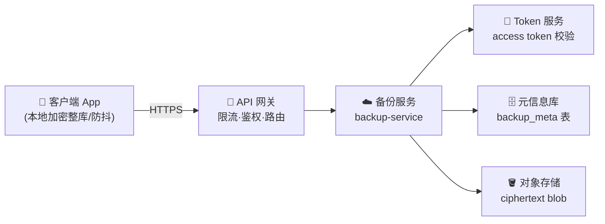
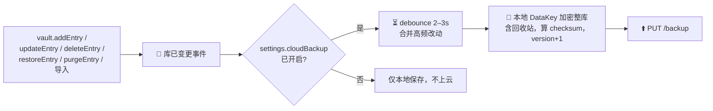
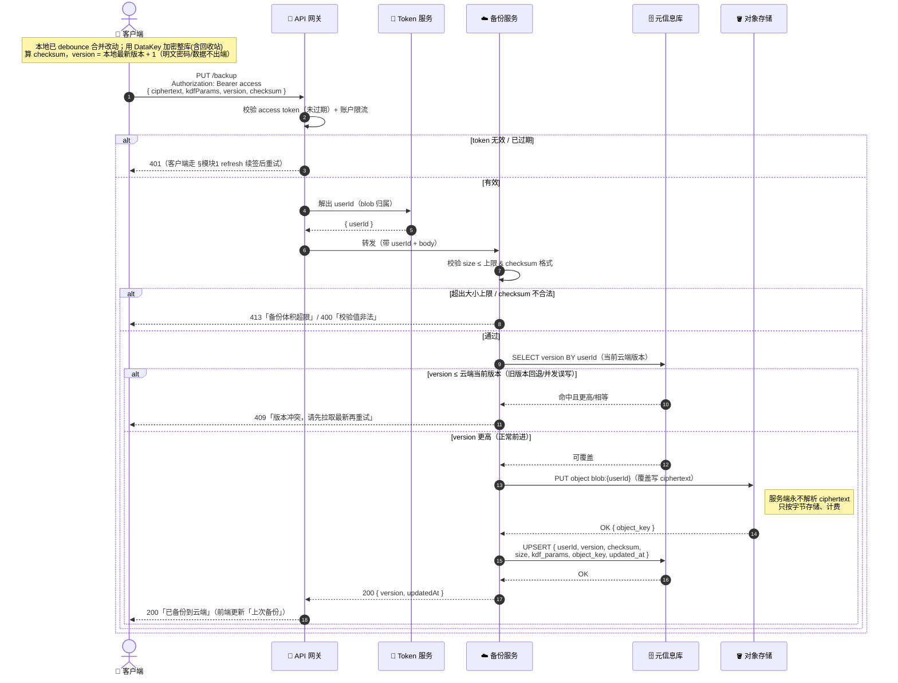
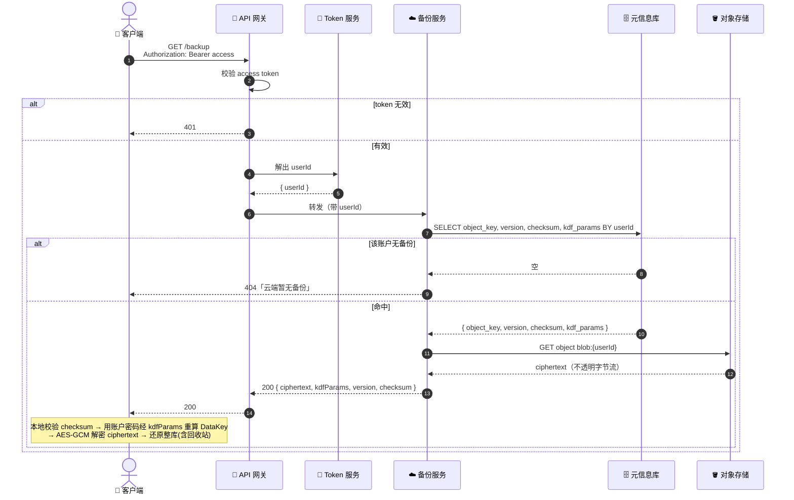
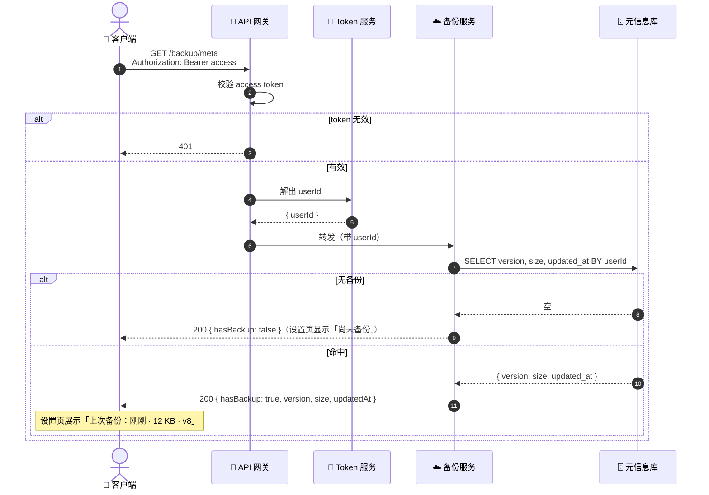
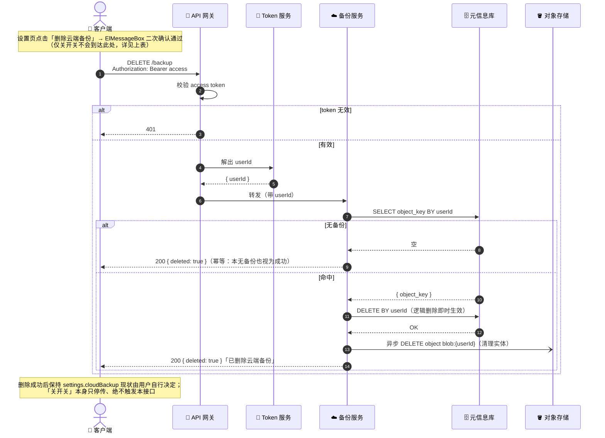

# SafeVault 模块 2：加密备份 blob 存储 — 后端交互时序图

> 配套文档：`SafeVault模块和接口设计 v1.0.md` 第二节「模块 2：加密备份 blob 存储（核心，唯一真正的业务后端）」。
> 本文从**客户端发起请求**出发，描绘请求在后端各关键组件间的流转，到结果返回的完整链路。
> 约束：**零知识**——客户端本地用云账户密码派生 DataKey 加密整库，发往后端的 `ciphertext` 后端**永不解析**；后端只读 `kdfParams` / `version` / `checksum` 等明文元信息，只负责存密文、防回退、计费。
> 更新日期：2026-06-09

---

## 一、后端组件总览

模块 2 是**唯一真正的业务后端**——一个加密 blob 托管服务（非逐条 CRUD 的密码服务）。涉及的后端关键组件及其职责：

| 组件 | 职责 | 关键存储 |
| --- | --- | --- |
| API 网关 | TLS 终结、按账户/IP 限流、转发、access token 预校验 | — |
| 备份服务 | 上传/下载/删除编排，版本防回退判定，checksum / 大小上限校验，blob 不透明透传 | — |
| Token 服务 | 校验 access token（短时效），解出 `userId` 用于 blob 归属鉴权 | Redis |
| 对象存储 | 存放整库密文 blob（`ciphertext`），按 `userId` 命名 key，服务端完全不透明 | 持久化 |
| 元信息库 | 每账户一条最新备份元信息：`version`、`checksum`、`size`、`kdf_params`、`object_key`、`updated_at` | 持久化 |

> **零知识要点**：对象存储里只有 `ciphertext`（AES-GCM 密文），**服务端永不解密、不解析其结构**；元信息库只存可读的派生配方与校验/版本字段，**不存任何明文密码或可还原密钥**。后端能做存储、防回退、计费，但拿不到库内任何明文。

---

## 二、备份触发来源（决策点 B）

模块 2 不为 vault 的每次增删改提供逐条接口——所有改动都汇聚成「**整库快照覆盖式上传**」。触发 `PUT /backup` 的前端动作：

| 前端动作（`stores/vault.js`） | 是否触发上传 | 说明 |
| --- | --- | --- |
| `addEntry` 新增 | ✅ | — |
| `updateEntry` 修改 | ✅ | — |
| `deleteEntry` 软删除 | ✅ | **决策点 B**：快照含回收站条目（保留 `deletedAt`），故软删改变快照 |
| `restoreEntry` 从回收站恢复 | ✅ | 同上，恢复也改变快照 |
| `purgeEntry` / `emptyTrash` 永久删除 | ✅ | — |
| 导入备份 | ✅ | 批量写入后触发一次 |

> **快照范围**：`ciphertext` 解密后的整库 JSON **同时包含活跃条目与回收站条目**，使「30 天可恢复」窗口在换机后延续。
> **上传前置（客户端本地）**：动作成功 → 发「库已变更」事件 → `composables/useCloudBackup.js` 监听 → 若 `settings.cloudBackup` 为真则 **debounce（2–3s）** 合并高频改动 → 本地用 DataKey 加密整库 → 才发 `PUT /backup`。

---

## 1. 上传整库快照 `PUT /backup`

最核心接口。**覆盖式**上传，body = `{ ciphertext, kdfParams, version, checksum }`。重点：access token 鉴权归属 → 大小/checksum 校验 → **单调 version 防回退**（拒绝旧版本覆盖新版本）→ 先写对象存储再更元信息（保证元信息指向有效 blob）。

> **为何先写对象存储再更元信息**：元信息库是「最新有效快照」的权威指针。若先更元信息再写 blob 失败，会指向不存在/旧 blob；反之即使元信息更新失败，旧元信息仍指向旧 blob，`GET /backup` 仍可用，下次重传可自愈。
> **防抖与防回退互补**：debounce 解决「高频触发」，version 单调递增解决「乱序/并发误写」，二者共同保证云端永远是更新的整库快照，且不做合并。

---

## 2. 下载最新快照 `GET /backup`

重装 / 换机后「从云端恢复」。后端只取 blob + 必要元信息原样返回；**解密在客户端本地**（用云账户密码经 `kdfParams` 重算 DataKey）。

> ⚠️ **关联决策点 C（见模块 3）**：若用户曾「忘记密码并邮箱验证码重置」，新密码派生的 DataKey 与旧 blob 不匹配，本地解密会失败。此时按决策点 C 处理：C1 提示「云备份不可解密、需重新上传」；C2 先经 `recovery-blob` 用恢复凭据解出 DataKey 再解密（`recovery-blob` 属模块 3，此处不展开）。

---

## 3. 仅取元信息 `GET /backup/meta`

设置页展示「上次备份：刚刚 / 体积 / 版本」。**不拉 blob**，轻量、低成本，可较频繁调用。

> **元信息无密码内容**：只回版本/大小/时间，不含 `ciphertext` 与 `checksum`（校验值仅在真正下载时才需）。设置页的「上次备份」副信息可挂在云账户卡片（`CloudAccountCard.vue`）。

---

## 4. 删除云端备份 `DELETE /backup`（方案 A：开关与删除解耦）

> **核心改动**：关闭云备份开关**仅停止后续上传**——纯本地置 `settings.cloudBackup = false`，**不调用任何后端接口、不动云端旧 blob**；只有用户在设置页**显式点击「删除云端备份」危险操作并二次确认**后，才调用 `DELETE /backup`。
> 这样把「我只是不想继续传」与「我要彻底清掉云端那份」两类意图**分开**：避免误触开关导致灾备数据不可逆丢失，同时仍给隐私敏感用户一条明确的彻底销毁路径。

**关开关 vs 删除按钮**两类操作语义对照：

| 用户操作 | 行为 | 是否调后端 | 云端旧 blob |
| --- | --- | --- | --- |
| 关闭云备份开关 | 停止后续上传（`settings.cloudBackup = false`） | ❌ 纯本地 | **保留**（换机仍可 `GET /backup` 恢复） |
| 点击「删除云端备份」 | 彻底销毁云端备份（红色危险样式 + 二次确认） | ✅ `DELETE /backup` | **删除** |

下图为**显式删除按钮**发起的链路（关开关不会走到这里）。先删元信息（使云端「逻辑上无备份」即时生效），再异步清理对象存储 blob，避免悬挂指针。

> **开关只停传、不删数据**：关闭云备份是高频、低摩擦的偏好切换，与「不可逆销毁」解耦后，误触开关不再造成灾备数据丢失；想恢复上传时重新打开开关即可（云端旧 blob 仍在，亦可继续 `PUT /backup` 覆盖）。
> **先删元信息再清 blob**：元信息一删，`GET /backup` 立即返回 404、`GET /backup/meta` 立即返回 `hasBackup:false`，用户感知即时；对象存储的实体清理可异步、可由生命周期策略兜底，避免阻塞主链路。
> **幂等**：重复点击删除或本无备份，统一返回成功，便于客户端无脑重试。

---

## 附：流程 ↔ 接口 ↔ 后端关键交互对照

| 时序图 | 接口 | 关键后端交互链路 |
| --- | --- | --- |
| §1 上传 | `PUT /backup` | access 鉴权解 userId → 大小/checksum 校验 → **version 防回退（旧版 409）** → 先写对象存储 blob → 再 UPSERT 元信息 |
| §2 下载 | `GET /backup` | access 鉴权 → 查元信息取 object_key → 取 blob 原样回传 → **解密在客户端** |
| §3 元信息 | `GET /backup/meta` | access 鉴权 → 仅查 version/size/updated_at（不拉 blob） |
| §4 删除 | `DELETE /backup` | **仅显式「删除云端备份」按钮触发**（关开关只停传不调用）→ access 鉴权 → 先删元信息（即时生效）→ 异步清对象存储 blob（幂等） |

> **零知识贯穿全程**：四个接口中后端始终只见 `ciphertext`（不透明字节）与 `kdfParams` / `version` / `checksum` / `size` 等明文元信息，**永不接触整库明文与密钥**，延续信任徽章「数据已本地加密·不上云（明文）」的承诺。
